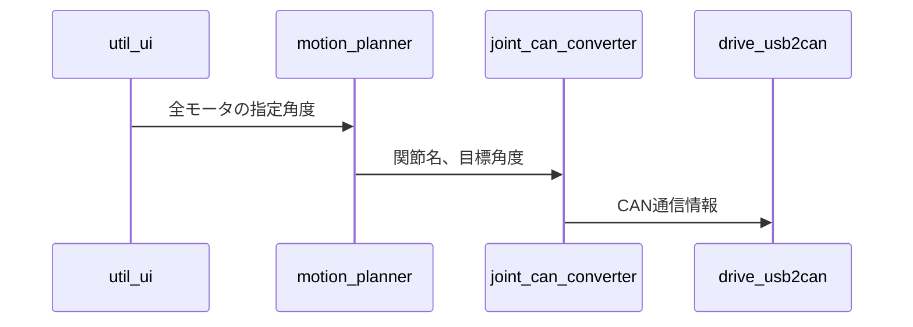
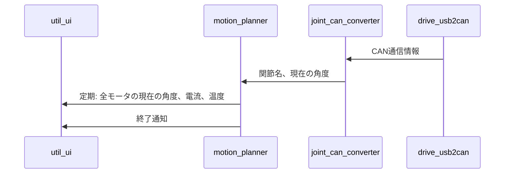
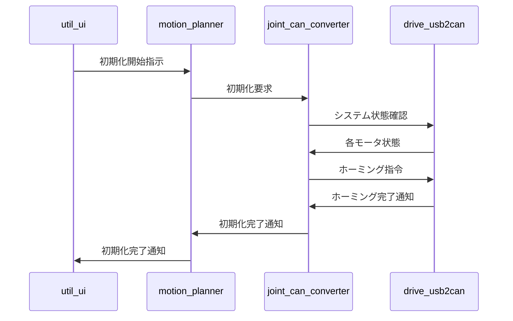

# ROS2 Pony 設計

## 目的
- ROS2を使用して4足歩行ロボットを制御
- 決まったパターンの動きをしながらポーズを取る

## 将来
- 強化学習等を用いて歩行などの自由な動きをシバックスで実現できるノウハウ蓄積

## 環境
- 制御コンピュータ
    - OS: Ubuntu 24.04.2
    - ROS2: Jazzy
    - マシン: raspberry piを想定
- アクチュエータ
    - モータ: AK60-6
        - CANで12個接続
- CANデバイス
    - innomaker usb2can
        - https://github.com/INNO-MAKER/usb2can
- 4足歩行ロボット
    - T社デザイン

## 構成

- 送信シーケンス案
    - 左にUnityやRvizが繋がる
    - 右にCANデバイスが繋がる

- 受信シーケンス案
    - 左にUnityやRvizが繋がる
    - 右にCANデバイスが繋がる

- 初期化シーケンス案
    - システム起動時の初期化処理

- ノード構成案
    - util_ui
        - UnityやRviz等のUIとのやり取り
        - ユーザから指示を与えたり、ユーザに状態を通知するなど
    - motion_planner
        - ユーザの指示を制御指示に変換する
        - パラメータ
            - モータ最大速度
            - モータ最大加速度
            - CAN送信頻度
        - 定期で状態を送信
        - 指示された制御が終わったら通知
        - 周期処理を担当する
    - joint_can_converter
        - 関節名と角度からCAN送信情報に変換
        - CAN受信情報から関節名と角度に変換
    - drive_usb2can
        - usb2canデバイスを使用してCAN送受信

- ノード再利用性や拡張性などについて
    - util_ui
        - あらかじめアニメーションを定義する場合は取り除くことができる
        - 複数のUIシステム（Unity、RViz、Web等）に対応可能な設計
    - motion_planner
        - 制御アルゴリズム（PID、MPC等）を変更する場合は別ノードを用意する
        - 状態監視と制御指示変換を分離可能な設計
        - 通信方式に依存しない設計（通信詳細は変換層に委譲）
    - joint_can_converter
        - アクチュエータとの通信方式を変更する場合、アクチュエータそのものを変更する場合に別ノードを用意する
        - 送受信変換を統合した単一ノード
        - 初期化シーケンス管理、ホーミング制御、システム状態監視を担当
    - drive_usb2can
        - CAN通信デバイスを変更する場合に別ノードを用意する
        - 送受信を統合した単一ノード

- メッセージ構成案
    - 全モータ角度
        - sensor_msgs/JointState : 角度[rad]を使用
            - それぞれを12要素使うようにする
    - 目標角度指定用
        - sensor_msgs/JointState : 関節名と角度[rad]を使用
    - CAN通信用
        - can_msgs/Frame
    - モータからのフィードバック用
        - string : 関節名
        - float64 : 角度 [rad]
        - float32 : 電流 [A]
        - int8 : 温度
    - 初期化用
        - std_srvs/Trigger : 初期化開始要求/完了通知
        - カスタムメッセージ : 初期化状態
            - uint8 state          # 初期化状態
            - bool is_complete     # 完了フラグ
            - string status_msg    # 状態メッセージ
    - システム状態監視用
        - カスタムメッセージ : SystemStatus
            - bool system_ready    # システム準備完了
            - string[] errors      # エラーリスト
            - float64[] joint_positions # 現在位置
    - ※注釈
        - JointState
            - string[] name         # 関節名
            - float64[] position    # 角度 [rad]
            - float64[] velocity    # 角速度 [rad/s]
            - float64[] effort      # トルク [Nm]
        - Frame
            - uint32 id          # CAN ID (11/29bit 共用)
            - uint8  dlc         # Data Length Code (0-8)
            - uint8[8] data      # ペイロード
            - uint8  err         # エラーフラグ
            - uint8  rtr         # RTR フレームか
            - uint8  eff         # 拡張 ID か

- 設定など
    - QoSをLowLatencyにする

- 電流監視
    - [x] それぞれ回転向きによって正負両方出るので合計する場合は絶対値を使う
    - [ ] 突入電流の対策を考える
        - [ ] 監視頻度を上げる？
            - モータのスペックでは1-500Hz
            - メッセージ頻度は変更可能
        - [ ] 突入電流が重ならないようにCANの送信タイミングを調整する
            - モータの実力が知りたい
            - 外部からの力には対応できるのか？

- TODO
    - ウォッチドッグ / Timeout
        - UI 側から目標が来なくてもモータが暴走しない設計を明記。
    - 緊急停止
        - ハードウェアスイッチ or Software Service を決めておく。
    - 温度や電流閾値監視
        - しきい値超過→モータ停止→UI 通知の流れを追記推奨。
    - 初期化機能
        - ホーミング機能の実装
        - 初期ポーズ設定
        - システム状態監視
        - 初期化失敗時の復旧処理 
